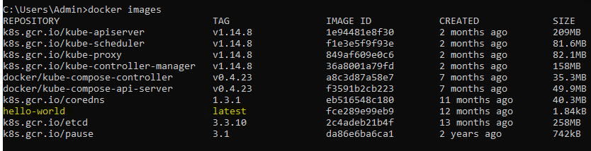
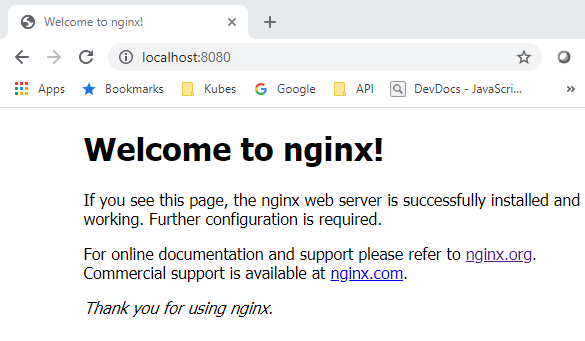

# ~~ The World of Containers ~~

### Simple Docker Run

We are going to jump right in and make sure you can run a Docker container locally by using the [Docker run command](https://docs.docker.com/engine/reference/commandline/run/).

The typical usage of the **docker run** command is as follows:
```
docker run [OPTIONS] IMAGE [COMMAND] [ARG...]
```
Notice the "**IMAGE**" refers to a pre-defined docker image that will be pulled down to run.

When we say pulled down, it means the docker image must be on your machine to run, if it doesn't exist locally, then it will be downloaded/pulled before it can be run as a container.

Enough talking, let's run a container.  Issue this command:

```
docker run hello-world:latest
```
This will cause Docker to pull down the latest version of the hello-world image and then run it. 
You should see something like this:

```
C:\Users\barry>docker run hello-world:latest
Unable to find image 'hello-world:latest' locally
latest: Pulling from library/hello-world
1b930d010525: Pull complete
Digest: sha256:4fe721ccc2e8dc7362278a29dc660d833570ec2682f4e4194f4ee23e415e1064
Status: Downloaded newer image for hello-world:latest

Hello from Docker!
This message shows that your installation appears to be working correctly.

To generate this message, Docker took the following steps:
 1. The Docker client contacted the Docker daemon.
 2. The Docker daemon pulled the "hello-world" image from the Docker Hub.
    (amd64)
 3. The Docker daemon created a new container from that image which runs the
    executable that produces the output you are currently reading.
 4. The Docker daemon streamed that output to the Docker client, which sent it
    to your terminal.

To try something more ambitious, you can run an Ubuntu container with:
 $ docker run -it ubuntu bash

Share images, automate workflows, and more with a free Docker ID:
 https://hub.docker.com/

For more examples and ideas, visit:
 https://docs.docker.com/get-started/
```

The output from this command actually tells you what it did.  When it says that it pulled the "hello-world" image from Docker Hub, it's referring to [hub.docker.com](https://hub.docker.com/) which is the main online repository for docker images.

Speaking of images, let's see what images you have installed locally.

Run the **Docker images** command to see the list of images on your machine.
```
docker images
```

After running this command, you should see something like this:


Notice the **hello-world** image that was downloaded when you issued the run command.

The K8s and docker images in the picture above are from the local Kubernetes installation. These K8s and Docker images were downloaded when you enabled Kubernetes on Docker Desktop.

### Run NGINX

Now we are going to run a simple [NGINX](http://nginx.org/en/) container that can be used to host web content.

We are going to use the **docker run** command again but use a different image (the nginx image) and also specify a port to expose the running container on.

Run this command:

```
docker run -p 8080:80 -d nginx
```
This will start a container running NGINX and spit out the container id. NGINX listens on port 80 by default, so we are telling Docker to expose the internal port 80 to our local port 8080.  Notice the -p for publishing ports follows the syntax of \<External Port\>:\<Internal Port\>.  The -d option says to run this container in detached mode.  
 
 **NOTE**: Without the -d option, the standard output of the container would be piped to your console. If you run without the -d, you would have to hit "CTRL + C" or similar break command to get back to a command prompt.  NOTE: On windows, using the CTRL + C to break back to the command prompt does not kill the running container. On unix or mac os, this will kill the running container.

 After running the docker run command you should be able to open up a browser and go to http://localhost:8080 and see the nginx welcome screen.  
 
 
 
After you've seen the NGINX welcome screen in the browser, refresh it a few times to get a few hits.

Now lets see how to look at the logs of your container.  First we need to find the container ID.  You should have seen the full container id spit out to the console when you ran the docker run command.  But if you lost that window, you can simply run a [docker ps](https://docs.docker.com/engine/reference/commandline/ps/) to see the currently running containers.
Do that now... run 
```
docker ps
```

You should see something like this:
```
D:\workspaces\DockerKubesDojo>docker ps
CONTAINER ID        IMAGE               COMMAND                  CREATED             STATUS              PORTS                  NAMES
7e65845aa3ee        nginx               "nginx -g 'daemon of…"   4 minutes ago       Up 4 minutes        0.0.0.0:8080->80/tcp   recursing_khayyam

```
Note the **CONTAINER ID** is the unique ID for your running conatiner.  It's crucial to know if you want to do anything later with your running container... like stopping it.

To see the logs of the current container, just run 
```
docker logs <container id>
```
 This should spit out the current logs of your running container.  In our case, it should just show a line for each hit to the NGINX welcome page.

If you actually, want to stop or kill the running container, you need to use the [docker stop](https://docs.docker.com/engine/reference/commandline/stop/) or the [docker kill](https://docs.docker.com/engine/reference/commandline/kill/) command.  I usually just kill them all and let the Docker gods sort em out.

However, we will be more humane and issue a docker stop command.  NOTE that you must end the command with the container id.

```
docker stop <YOUR CONTAINER ID>
```
After this, re-run your **docker ps** command and notice that the container should no longer be running.


### Interacting Directly with Containers

Many times you may need to interact with a running container.  Typically this is the case for trouble shooting, but there can be other tasks you may need to perform directly on a running container.

For this exercise, you will exec(shell) into the running container and find where the NGINX index.html file is and write it out to the console.  In order to get into the running container we are going to use the [docker exec](https://docs.docker.com/engine/reference/commandline/exec/) command.  The docker exec command allows you to run a command in a running container.  In our case we are going to tell it to run the bash shell and pipe the input and output back to our current terminal.

*Note*: Windows users should use the command prompt or powershell for this.  If you must use something like git bash on Windows, you will most likely have to prefix the entire docker exec command with 'winpty' to get around tty errors. This is only for running docker exec commands that pipe the input and output to the terminal (that is using the '-it' option).  Mac and Linux users ignore this note.

Restart your container by running the docker run command again:

```
docker run -p 8080:80 -d nginx
```

Now run the docker exec command like this: (**NOTE**: be sure to replace <container id> with your container id).

```
docker exec -it <container id> bash
```

This should this give you a bash prompt that looks something like this:

```
root@29870e595384:/#

```

Now you are at a bash prompt inside the running container.  Issue an "ls" command to see the contents of the files of the directory you are in.

Now use docker hub to find out where the nginx html files are stored.  Go to hub.docker.com and search for the nginx container and find where it stores its html files.

For fun, you can override the index.html command by just echoing something else into it like this:
```
echo "All your html are belong to us" > index.html

```
If you do it correctly, you should be able to open a browser to http://localhost:8080 again and see your new message instead of the default nginx greeting.

Try killing the container and then start a new ngnx container. Then check the index.html in the new container.  Is your message still there? Why wouldn't it be there?

 
## Summary of Commands from this Tutorial:
  
 **[docker run <options> <imagename>:<tag>](https://docs.docker.com/engine/reference/commandline/run/)** -  the run command starts a container based off the image you specify.  After "run" you specify any options such as "-p 8080:80" to specify a port mapping. After the options, you specify the image you wish to use to create the container.  Later we will see that after the image name it's possible to pass arguments to the container as well.
 
 
 **[docker images](https://docs.docker.com/engine/reference/commandline/images/)** -  Displays the images you have pulled locally on your machine.  A docker run command will attempt first to find the image locally, but will then go to hub.docker.com to pull the image if it's not available in your local images.
 
 
 **[docker ps](https://docs.docker.com/engine/reference/commandline/ps/)** - Shows running docker containers. Adding the '-a' option shows all containers not just running ones.
 
 **[docker stop/kill <container id> or <container name>](https://docs.docker.com/engine/reference/commandline/stop/)** - Stops running docker containers.
 
 **[docker exec <container id> <command>](https://docs.docker.com/engine/reference/commandline/exec/)** - Stops running docker containers.

 **[docker logs <container id>](https://docs.docker.com/engine/reference/commandline/logs/)** - Retrieves Logs from Container.
 
 
 
